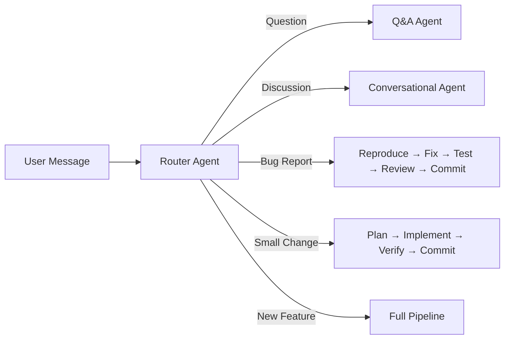

The promise of autonomous AI coding agents is seductive: describe what you want, walk away, come back to a PR. The reality in early 2026 is more nuanced — but the gap between promise and practice is closing fast. After researching the latest approaches and building my own multi-agent system, I've arrived at a practical architecture that handles everything from "hey, what does this module do?" to "build me a new authentication system."

This isn't another tool comparison. This is a playbook for building an adaptive pipeline that knows when to spin up a full feature workflow and when to just answer a question.

## The Problem with Fixed Pipelines

Most tutorials on multi-agent coding systems describe a linear pipeline: requirements → plan → code → test → review → commit. That works great when every input is a feature request. But real projects don't work that way. Sometimes a user sends a bug report. Sometimes they just have a question about the codebase. Sometimes they want a quick refactor.

A fixed pipeline either over-processes simple requests (running a full feature cycle for a one-line fix) or under-processes complex ones (treating a new feature like a quick change). You need adaptive orchestration — a system that classifies intent and activates the right workflow.

## The Architecture: Router + Specialised Workflows

The core pattern is a **router agent** at the entry point that dispatches to specialised workflows based on what the user actually needs.



The router doesn't need to be sophisticated. A single LLM call with the project context and a clear classification prompt works well. The important thing is that it has enough context to make a good routing decision: the requirements doc, recent progress file, and a codebase structure summary.

When intent is ambiguous — "the login page feels slow" could be a bug, a feature request, or just a question — the router should **ask the user to clarify** rather than guess. As the team at [Augment Code discovered](https://www.augmentcode.com/blog/best-practices-for-using-ai-coding-agents), the key to working effectively with agents is to treat them as collaboration with a fellow engineer. Everything else follows from that.

## The Full Feature Pipeline

When the router identifies a genuine new feature request, the full pipeline activates. Here's each stage, informed by the latest research:

### Stage 0: Initialiser Agent

This is the piece most tutorials skip, and it's arguably the most important. Anthropic's engineering team [published their findings](https://www.anthropic.com/engineering/effective-harnesses-for-long-running-agents) on what makes long-running agents actually work, and the initialiser agent was central to their solution.

The initialiser runs once at project setup and creates:

- A **structured feature list** in JSON (not markdown — agents are less likely to inappropriately modify JSON files)
- An `init.sh` script for spinning up the dev environment
- A `PROGRESS.md` file that tracks what each agent session accomplished
- An initial git commit establishing the baseline

Every feature starts marked as `"passes": false`. This prevents a later agent from looking around, seeing progress, and declaring victory prematurely — one of the most common failure modes Anthropic observed.

```json
{
  "category": "functional",
  "description": "User can create a new coffee recipe with name, beans, and method",
  "steps": [
    "Navigate to recipe creation page",
    "Fill in recipe details",
    "Submit and verify recipe appears in list"
  ],
  "passes": false
}
```

### Stage 1: Requirements Clarification Agent

This agent has access to the existing project requirements and the feature list. Its job is to take the user's request and produce a machine-readable specification — not just a human-readable doc.

The [TDFlow research paper](https://arxiv.org/html/2510.23761v1) specifically found that workflows with sub-agents outperform monolithic agents because a single agent struggles to simultaneously decompose and execute complex tasks. Separating "understand what we're building" from "build it" is a structural advantage.

This agent outputs:
- Updated feature entries in the JSON feature list
- Acceptance criteria that can be translated to tests
- Dependency mapping to existing features

### Stage 2: Planning Agent

This agent has read access to the full codebase. It reads the requirements from Stage 1 and produces an implementation plan. The critical constraint, per Anthropic's research: **one feature at a time**. Their experiments showed that prompting agents to work incrementally was critical to addressing the tendency to do too much at once.

The plan should specify:
- Which files need modification
- What tests need to be written (TDD-first)
- The order of operations
- What "done" looks like in terms of verifiable behaviour

The [Agentic Coding Handbook's TDD section](https://tweag.github.io/agentic-coding-handbook/WORKFLOW_TDD/) has a great framing: tests act as prompts. Instead of telling the agent "generate a function that filters valid emails," you express it as `it('should return only valid emails from a mixed list')` and the agent writes code to pass that test. Red-Green-Refactor becomes the feedback loop that gives the agent "eyes."

### Stage 3: Implementation Agent

This is where code gets written. The agent follows the plan from Stage 2, writing tests first, then implementing code to pass them.

The biggest insight from Anthropic's work: **unit tests are not enough**. Their agents would pass all unit tests and curl checks but fail end-to-end. The fix was giving agents browser automation tools (Puppeteer MCP (Model Context Protocol)) to test features as a human user would — clicking through the UI, verifying visual state, checking actual behaviour.

Include in this agent's toolkit:
- Test runner access
- Linter
- Browser automation for E2E verification
- Ability to start/restart the dev server

And add strongly-worded guardrails in the prompt: "It is unacceptable to remove or edit existing tests. This could lead to missing or buggy functionality." Without this, agents will silently delete failing tests to make things "pass."

### Stage 4: Code Review Agents (Parallel)

Run multiple review agents in parallel, each with a specific focus:

- **Quality reviewer**: code style, patterns, maintainability
- **Security reviewer**: vulnerability scanning, input validation, auth checks
- **Performance reviewer**: N+1 queries (repeated database calls per item), unnecessary allocations, caching opportunities

Research on multi-agent systems confirms this approach: distinct agents operating in parallel with relative independence enables specialisation that a single agent cannot achieve.

### Stage 5: Address Reviews + Re-verify

The implementation agent processes review feedback, makes changes, and re-runs the full verification suite. This is not optional — it's the stage that catches regressions introduced by review fixes.

### Stage 6: Commit, Push, PR

The agent commits with descriptive messages and writes a summary to the progress file. Anthropic found this was essential: structured commit messages and progress notes allow the next agent session to quickly understand project state via `git log` rather than re-analysing the entire codebase.

## The "Get Up to Speed" Ritual

Every agent session — regardless of which workflow the router selected — should start with the same ritual:

1. `pwd` — orient to the workspace
2. Read `PROGRESS.md` and `git log --oneline -20`
3. Run `init.sh` to start the dev server
4. Run a basic smoke test on existing functionality
5. Only then start the actual task

Anthropic's team found this ensured agents could quickly identify if the app was left in a broken state, and fix existing bugs before making things worse with new changes. Without this step, agents would start implementing features on top of broken code.

## Session Memory: Files, Not Context

The hardest problem in multi-session agent work is continuity. Each new context window starts blank. The solution emerging across all the research is the same: **structured artifacts committed to the repo**.

- `feature_list.json` — what's done, what's not
- `PROGRESS.md` — what each session accomplished
- `decisions.log` — architectural decisions and their rationale
- `guidelines.md` — project conventions, patterns, and anti-patterns for every agent to follow
- Git history — the ground truth of what changed and why

Steve Yegge's "Beads" system takes this further with issues stored as JSONL (line-delimited JSON) in git, cached in SQLite for fast queries, with hash-based IDs designed to prevent merge conflicts in multi-agent workflows. His insight: when he asked Claude what it wanted for memory, Claude designed the git-backed architecture itself.

This approach means agents don't need to rely on context windows for continuity. They read files, understand state, and contribute incrementally — exactly like a new engineer joining a well-documented project.

## Human-in-the-Loop: Graduated Trust

Not every workflow needs the same level of human oversight. The router can assign an approval level alongside the workflow. **Questions** run autonomously with no gates. **Bug fixes** need approval before commit. **Small changes** add a plan approval step. **New features** gate at requirements, plan, and PR — the full trust ladder.

This graduated approach matches what a [UC San Diego/Cornell study from December 2025](https://mikemason.ca/writing/ai-coding-agents-jan-2026/) found when observing experienced developers: professionals don't "vibe code" — they maintain agency in software design and deploy explicit control strategies. The pipeline should support that, not fight it.

---

## Best Practices Checklist

- **Route by intent** — classify every input before choosing a workflow
- **Ask, don't guess** — when intent is ambiguous, clarify with the user
- **One feature at a time** — agents that multitask introduce compounding errors
- **Start every session with orientation** — read `PROGRESS.md`, check `git log`, run a smoke test
- **Tests as prompts** — write the test first, let the agent implement to pass it
- **Never trust unit tests alone** — add E2E verification with browser automation
- **Guard existing tests** — explicitly forbid agents from deleting or editing tests to force a pass
- **Run parallel reviewers** — quality, security, and performance each deserve a focused pass
- **Re-verify after review fixes** — review changes can introduce regressions
- **Persist state in files, not context** — feature lists, progress logs, and decision records belong in the repo
- **Graduate trust** — more complex workflows get more human approval gates
- **Earn each stage** — if an agent stage doesn't catch errors or add quality, remove it

## What the Research Actually Shows

Google's 2025 DORA Report found that increased AI adoption correlated with higher bug rates, longer code review times, and larger PRs. The verification loops in this pipeline are the antidote — most teams inflating those numbers are the ones skipping proper testing and review stages.

Research on evolving orchestration from [Dang et al. (2025)](https://arxiv.org/abs/2505.19591) reinforces this: the best multi-agent configurations tend to converge on more compact, cyclic reasoning structures rather than sprawling linear pipelines. Each stage should earn its place by catching errors or adding quality that the previous stage missed.

2026 is shaping up as the year autonomous agents move from individual productivity tools to restructuring the software development lifecycle itself. The adaptive pipeline described here is one practical implementation of that [AI-native](/posts/2026-02-20-what-is-ai-native/) shift. The gap isn't in the models anymore — they're capable enough. The gap is in the harness: the routing logic, the feedback loops, the session continuity, and the guardrails that keep agents honest.

The models will keep getting better. The harness is where the craft lives now.

---

## Further Reading

- [Multi-Agent Software Development](https://arxiv.org/html/2601.13671v1) — arXiv
- [Vibe Coding vs. Agentic Coding](https://arxiv.org/html/2505.19443v1) — arXiv
- [Background Coding Agents: Predictable Results Through Strong Feedback Loops](https://engineering.atspotify.com/2025/12/feedback-loops-background-coding-agents-part-3) — Spotify Engineering
