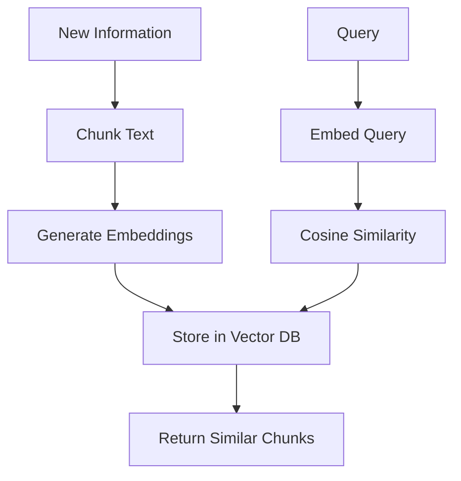
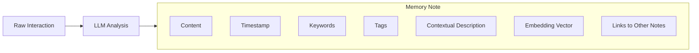
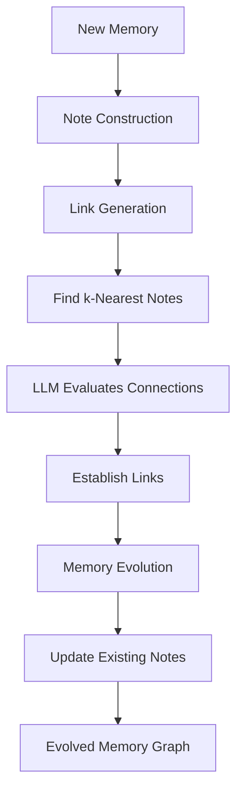
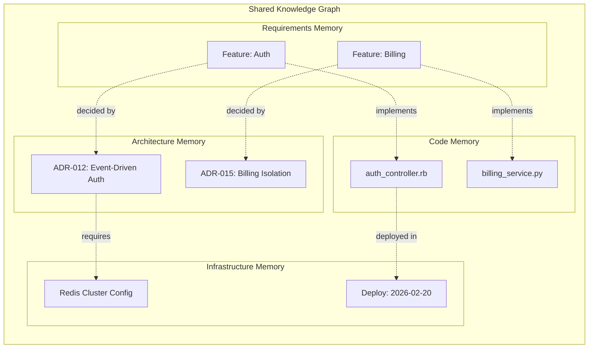
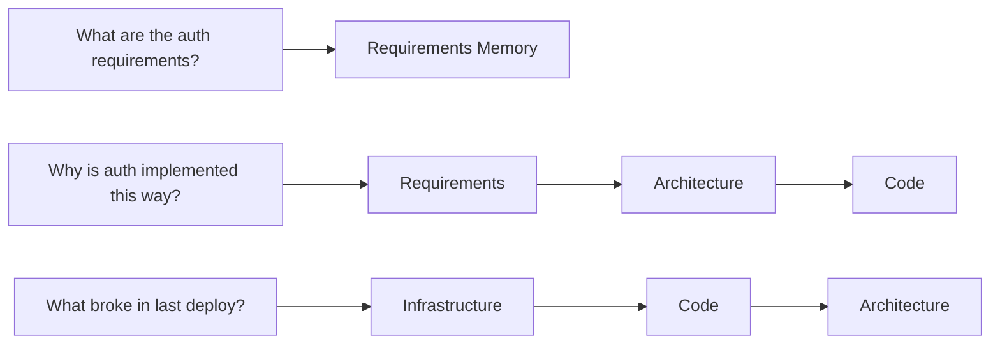
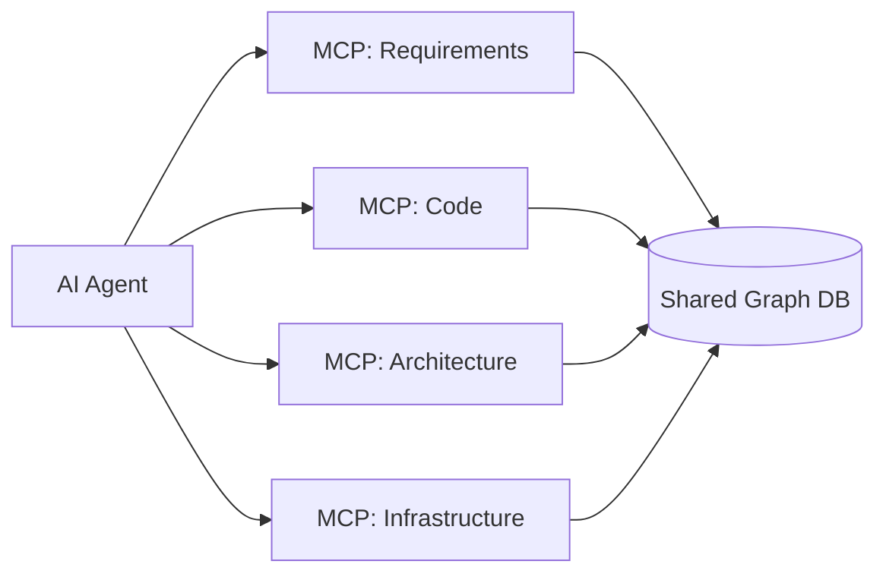

Every AI coding agent has the same dirty secret: it starts each session with amnesia. Your agent knows how to write code, but it doesn't know *your* code, *your* architecture decisions, or *why* that one service is structured the way it is. Context windows are duct tape. The real fix is structured, persistent memory that evolves with your project.

Recent research — especially A-MEM (NeurIPS 2025) and the "Memory in the Age of AI Agents" survey (Dec 2025) — is converging on what that fix looks like. This post breaks down the core ideas and proposes a practical architecture for software projects: **federated memory with cross-domain linking**.

## The Problem With Flat Memory

Most agent memory today works like this: dump text into chunks, embed them as vectors, retrieve by similarity. Claude uses `CLAUDE.md`. Cursor has its project context. They all share the same fundamental limitation.

This works for simple lookups — "what's the database password" or "what framework are we using." It completely breaks down when you need **multi-hop reasoning**: connecting facts across conversations, understanding relationships, or tracing decisions to their consequences.

Monday, you tell the agent: "Alice manages the auth team." Wednesday, you ask: "Who should I talk to about permission scoping?" The agent retrieves both facts independently but can't connect them. It knows Alice exists and auth exists, but the *manages* relationship is buried in text, not encoded as structure.

Now scale that to a real software project: hundreds of requirements, thousands of commits, dozens of architecture decisions, infrastructure that evolves weekly. Flat memory doesn't just degrade — it becomes actively misleading, surfacing stale context with high confidence.

## A-MEM: Memory That Organises Itself

A-MEM, published at NeurIPS 2025, takes a fundamentally different approach. Instead of storing text chunks, it creates **structured memory notes** inspired by the Zettelkasten method — the slip-box system that Niklas Luhmann used to produce 70 books and 400 articles over his career.

Each memory note is an atom with multiple attributes:

The LLM doesn't just store the raw content — it generates keywords, tags, and a contextual description that captures the *meaning* behind the interaction. This multi-faceted representation enables nuanced retrieval that goes beyond embedding similarity.

But the real innovation is what happens *after* storage.

### Link Generation

When a new note is created, A-MEM searches for the nearest existing notes by embedding similarity, then asks the LLM to evaluate whether meaningful connections exist. These connections aren't predefined schemas — they emerge organically from the content.

### Memory Evolution

This is the part that matters most. When a new memory is integrated, it can **trigger updates to existing memories**. The contextual descriptions, keywords, and tags of related historical notes get refined based on the new information. The memory network doesn't just grow — it deepens its understanding over time.

This bidirectional evolution — new information reshaping old context — is what makes A-MEM qualitatively different from RAG. RAG maintains a static knowledge base with dynamic retrieval. A-MEM maintains a **living** knowledge base where the structure itself learns.

## Software Projects Need Federated Memory

A-MEM was designed for conversational agents. Software projects are a different beast. A codebase contains fundamentally different *types* of knowledge, each with different lifecycles, retrieval patterns, and evolution rates.

Consider four domains that every non-trivial project has:

- **Requirements** — evolves on stakeholder feedback and user data. Multi-hop retrieval (feature → capability → integration). Medium stability — changes with product direction.
- **Code** — evolves on commits, test results, and reviews. Recency-weighted, precise retrieval. Low stability — changes constantly.
- **Architecture** — evolves on Architecture Decision Records (ADRs) and incident learnings. High-stability, rationale-focused retrieval. Decisions persist.
- **Infrastructure** — evolves on deployments, incidents, and config changes. Event-correlation retrieval. Medium stability — evolves with scale.

Dumping all of these into one memory store creates two problems:

**Retrieval noise.** When the agent asks "what constraints apply to the auth service?", you don't want to wade through 500 Terraform state memories to find the three architecture decisions that matter.

**Evolution contamination.** If requirements memory evolves every time a commit lands (because code "evidence" flows in), you get constant churn on notes that should be relatively stable. The requirements for "user authentication" shouldn't get rewritten because someone fixed a typo in the login controller.

### But Full Separation Kills the Value

Here's the tension: A-MEM's entire value proposition is **cross-linking**. The most valuable insights in a software project live at the boundaries between domains:

- "This requirement is impossible given this infrastructure constraint"
- "This architecture decision was made for a requirement that was deprecated six months ago"
- "These three code changes all trace back to a single design decision"

If you fully silo the memories, you lose exactly the multi-hop reasoning that makes knowledge graphs valuable. You're back to the flat retrieval problem, just with four smaller flat stores instead of one big one.

## The Architecture: One Graph, Multiple Namespaces

The solution is **federated memory**: separate namespaces with domain-specific behaviour, backed by a shared graph that allows cross-domain traversal.

Each namespace gets its own:

**Note construction prompts.** The LLM prompt that generates keywords, tags, and context is tuned per domain. A requirements note needs attributes like stakeholder, priority, and acceptance criteria. A code note needs file paths, test coverage, and complexity. An architecture note needs quality attributes, tradeoffs, and rationale. These are different *shapes* of knowledge.

**Evolution triggers.** Requirements memory evolves on stakeholder feedback and user data. Code memory evolves on commits and test results. Architecture memory evolves only on explicit ADR updates or significant incident learnings. Infrastructure memory evolves on deployment events. You control what signals flow where, preventing cross-contamination.

**Retrieval scoping.** Queries default to the relevant namespace but can traverse cross-domain links when needed:

The **link generation** step — A-MEM's section 3.2 — operates across all namespaces. When a new code memory is created from a commit, the nearest-neighbour search for link candidates searches requirements and architecture too. The LLM then decides if a meaningful connection exists. This is where emergent cross-domain understanding lives.

## Implementation: MCP Servers Per Domain

In practice, each namespace maps to an MCP (Model Context Protocol) server or tool group. This gives you clean separation at the API level while allowing the underlying graph to be shared.

Each MCP server exposes domain-specific tools:

- `requirements/search` — scoped to requirements namespace
- `requirements/add` — with requirements-specific note construction
- `code/search` — recency-weighted, file-path aware
- `architecture/search` — rationale-focused, high-stability
- `cross_domain/traverse` — follows links across namespaces

The agent learns which tools to use for which queries. Simple questions stay in-domain. Complex questions that span domains trigger cross-domain traversal through the shared link structure.

## Choosing the Backing Store

The "Shared Graph DB" in the diagram above needs to do two things well: **graph traversal** for multi-hop cross-domain queries, and **vector similarity search** for embedding-based link generation. Most databases are built for one or the other, not both. Neo4j (with native vector indexes since 5.11), PostgreSQL with pgvector and Apache AGE, and FalkorDB all support both to varying degrees — look for a store where the nearest-neighbour search for link candidates and the multi-hop traversal run against a single data layer rather than two systems with a sync layer between them.

## What Memory Evolution Looks Like in Practice

Here's a concrete scenario. Your project has an auth service. Over three months:

**Month 1:** A requirement is created: "Users must be able to authenticate via SSO." An architecture decision is made: "Use event-driven auth with Redis session store." Code is written implementing the auth controller.

A-MEM creates notes in each namespace and generates cross-domain links: the requirement links to the ADR, the ADR links to the code, the code links to the infrastructure config.

**Month 2:** An incident occurs — Redis cluster fails under load during a traffic spike. The infrastructure memory gets a new note about the incident. A-MEM's evolution mechanism kicks in: the architecture note for "event-driven auth with Redis" gets its contextual description updated to include "known scaling limitation under high concurrent session load." The requirement note doesn't change — the requirement is still valid.

**Month 3:** A new requirement arrives: "Support 10x current auth throughput for enterprise launch." When the agent processes this, cross-domain link generation connects it to the architecture note (which now carries the scaling caveat from the incident) and the infrastructure note about the Redis failure. The agent can now reason: "this new requirement conflicts with a known infrastructure limitation identified in the February incident."

No human had to manually connect these dots. The memory system evolved its understanding through the natural flow of project events.

## The Research Frontier

A-MEM is one approach. The field is moving fast. A few directions worth watching:

**MemRL (Jan 2026)** explores using reinforcement learning to teach agents *when* to store and *what* to retrieve — treating memory operations as learnable actions rather than fixed rules.

**MemEvolve (Dec 2025)** introduces meta-evolution: not just evolving individual memories, but evolving the *rules* by which memories evolve. The memory system itself adapts over time.

**MAGMA (Jan 2026)** proposes multi-graph architectures where different types of relationships (temporal, causal, structural) live in separate graph layers that can be queried independently or jointly.

The common thread across all of these: memory is becoming a **first-class primitive** in agent design, not an afterthought. The agent memory market is [projected to grow from $6.3B in 2025 to $28.5B by 2030](https://www.mordorintelligence.com/industry-reports/agentic-ai-market). Google's Vertex AI [started metering memory and session primitives](https://cloud.google.com/vertex-ai/docs/release-notes) in January 2026. Memory is infrastructure now.

## Key Takeaways

**Flat vector search isn't memory.** It's search. Memory requires structure, relationships, and evolution.

**A-MEM's Zettelkasten approach works** because it treats each memory as an atom with rich attributes and lets connections emerge organically through LLM-driven link generation and evolution.

**Software projects need federated memory** — separate namespaces for requirements, code, architecture, and infrastructure, with domain-specific note construction and evolution triggers.

**But cross-domain links are the whole point.** Full separation kills the multi-hop reasoning that makes knowledge graphs valuable. One graph, multiple namespaces, shared link generation.

**MCP gives you the right abstraction** — domain-specific tools backed by a shared graph, letting the agent learn which memory to query for which questions.

The agent that remembers your project — not just your latest prompt — is the one that will actually ship software.

---

*References:
[A-MEM: Agentic Memory for LLM Agents](https://arxiv.org/abs/2502.12110) (NeurIPS 2025),
[Memory in the Age of AI Agents](https://arxiv.org/abs/2512.13564) (Dec 2025 survey)*
