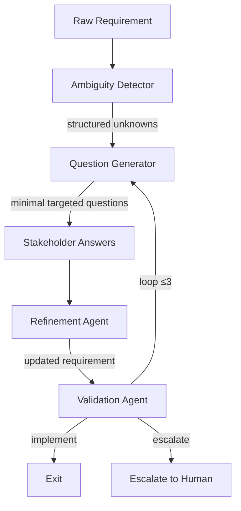

Given an ambiguous request, a well-trained model asks for clarification rather than barrel forward with assumptions. That behaviour isn't scripted. It's trained. And understanding how it got there tells you something useful about your own work.

---

## It's in the Weights

Everything a model "knows" — facts, behaviours, tendencies — is encoded in the weights. No runtime rules engine, no checklist. When a model asks a clarifying question, it's following a path that training made high-probability. (This is distinct from [context engineering](/posts/2026-03-16-context-engineering/), which shapes what goes *into* the context window — here we're looking at what training baked *into* the weights.)

The mechanism is RLHF. Human raters compare outputs, a reward model learns their preferences, and PPO updates the weights toward higher-scoring responses. PPO's key contribution is a trust region constraint — it clips each update so the policy can't drift too far per step. Without it, the model exploits the reward function rather than improving against it.

The result: behaviours like clarification-seeking get baked in through millions of bounded gradient steps. The model asks good questions because asking good questions got rewarded, at scale.

---

## The Same Problem

The ambiguity problem in LLM training and the ambiguity problem in requirements engineering are the same problem. Underspecified input leads to divergent interpretations. Proceeding on a wrong assumption costs more than asking. The discipline is identical: identify decision-relevant unknowns before generating output.

The failure mode in requirements is almost always under-asking. A requirement feels clear enough, you fill the gap with a plausible assumption, you build. Then you demo it.

---

## The Practical Discipline

**Treat ambiguity as a branch point.** If a requirement could mean two things that lead to different implementations, that's a fork — not a detail. Resolve it before writing code.

**Surface assumptions explicitly.** If you can't resolve it immediately, document the assumption. A visible assumption can be challenged. A silent one can't.

**Know what's resolvable.** Some ambiguities dissolve with a question. Others are genuinely undecided — the stakeholder doesn't know yet. Don't waste clarification cycles on the latter. The discipline is telling them apart.

---

The irony: engineering teams building *with* models that handle ambiguity well often handle requirements ambiguity worse than the models they're deploying.

The behaviour is in the weights. The question is whether it's in your process.

---

## Building the Pipeline

Here's the core loop:



Four agents. Each with a narrow job. Key design constraint: **cap iterations at 2-3**. If it's not resolved by then, it's not a clarification problem — it's a product decision. Escalate, don't loop.

---

### Agent 1: Ambiguity Detector

This is the load-bearing step. Everything downstream depends on getting structured, typed ambiguities out of raw requirement text.

**Prompt:**

```text
You are an expert requirements analyst. Given a raw requirement, identify all
ambiguities that would prevent a developer from implementing it correctly.

For each ambiguity, output:
- type: one of [missing_constraint, conflicting, underspecified, assumption]
- text: what exactly is ambiguous, in one sentence
- impact: high | medium | low (based on implementation divergence risk)
- resolvable: true if a stakeholder question can resolve it,
              false if it requires a product decision

Return ONLY a JSON array. No preamble.

Requirement: {requirement}
```

**Output schema:**

```json
[
  {
    "type": "missing_constraint",
    "text": "No rate limit specified for the API endpoint",
    "impact": "high",
    "resolvable": true
  },
  {
    "type": "conflicting",
    "text": "Real-time sync requirement conflicts with offline-first constraint",
    "impact": "high",
    "resolvable": false
  }
]
```

Filter immediately: only pass `impact: high` + `resolvable: true` to the next agent. Low-impact ambiguities get a documented assumption. `resolvable: false` items get an escalation flag — don't let the pipeline try to resolve a product decision.

---

### Agent 2: Question Generator

Takes the filtered ambiguity list and produces the minimum questions to resolve maximum ambiguity. The prompt enforces consolidation — you don't want to interrogate your stakeholder.

**Prompt:**

```text
You are preparing a requirements clarification session. Given a list of
ambiguities, generate the minimum set of questions that resolves all of them.

Rules:
- Consolidate where possible — one question can resolve multiple ambiguities
- Never ask what can be reasonably inferred from context
- Never ask about low-stakes details that can be decided during implementation
- Each question must be answerable without technical knowledge
- Maximum 5 questions regardless of ambiguity count

Ambiguities: {ambiguities_json}
Context: {requirement}

Return ONLY a JSON array of question strings.
```

The 5-question hard cap matters. If you have more than 5 unresolvable high-impact ambiguities, the requirement isn't ready — send it back before running the pipeline.

---

### Agent 3: Refinement Agent

Takes the original requirement plus Q&A pairs and rewrites the requirement to be unambiguous. Be explicit about what to preserve and how to flag new ambiguities introduced by the answers.

**Prompt:**

```text
You are rewriting a software requirement to eliminate ambiguity based on
stakeholder answers.

Rules:
- Preserve all original intent
- Incorporate every answer as a concrete constraint
- Where answers introduced new ambiguity, flag inline: [UNRESOLVED: <description>]
- Do not add constraints not present in the original or the answers
- Output: refined requirement as prose, then a bullet list of assumptions made

Original requirement: {requirement}

Q&A:
{qa_pairs}
```

The `[UNRESOLVED: ...]` inline flag is machine-readable for the Validation Agent and visible to human reviewers. Don't skip it — answers frequently introduce new ambiguity, especially when stakeholders hedge.

---

### Agent 4: Validation Agent

Checks whether the refined requirement is actually implementable or just shuffled the ambiguity around.

**Prompt:**

```text
You are validating whether a software requirement is sufficiently specified
for implementation.

A requirement passes if:
- A developer could implement it without making any business logic decisions
- All edge cases affecting system behaviour are covered
- There are no conflicting constraints

Check for [UNRESOLVED] flags and any implicit ambiguities the refinement introduced.

Return JSON only:
{
  "passes": true | false,
  "remaining_ambiguities": [],
  "recommendation": "implement | loop | escalate"
}

Requirement: {refined_requirement}
```

`recommendation` drives the loop: `implement` exits, `loop` goes back to Question Generator with remaining ambiguities, `escalate` surfaces a conflict needing a human product decision.

---

### The Assumption Log

Every exit from the pipeline — including clean ones — should emit an assumption log alongside the refined requirement:

```json
{
  "requirement_id": "REQ-042",
  "refined": "...",
  "assumptions": [
    {
      "original_ambiguity": "No rate limit specified",
      "assumption": "Default to 100 req/min consistent with existing endpoints",
      "impact": "low",
      "review_by": null
    }
  ],
  "escalations": [
    {
      "ambiguity": "Real-time sync conflicts with offline-first",
      "reason": "Product decision required",
      "review_by": "product owner"
    }
  ],
  "iterations": 2
}
```

This log is the real artifact. The refined requirement tells developers what to build. The assumption log tells everyone what was decided, why, and what to revisit when the requirement changes. When code diverges from spec, it's almost always traceable to a silent assumption that never got recorded.

---

### Wiring It Together

```python
MAX_ITERATIONS = 3

def clarify_requirement(requirement: str, qa_fn) -> dict:
    iteration = 0
    current = requirement
    assumption_log = []

    while iteration < MAX_ITERATIONS:
        ambiguities = detect_ambiguities(current)
        actionable = [a for a in ambiguities
                      if a["impact"] == "high" and a["resolvable"]]

        if not actionable:
            break

        questions = generate_questions(actionable, current)
        answers = qa_fn(questions)  # human-in-the-loop or async
        current, assumptions = refine_requirement(current, answers)
        assumption_log.extend(assumptions)

        validation = validate_requirement(current)
        if validation["recommendation"] == "implement":
            break
        if validation["recommendation"] == "escalate":
            return {"status": "escalate", "requirement": current,
                    "assumptions": assumption_log}

        iteration += 1

    return {"status": "implement", "requirement": current,
            "assumptions": assumption_log, "iterations": iteration}
```

`qa_fn` is the seam where you decide whether this is human-in-the-loop (async Slack message, form) or automated (an LLM acting as a product owner proxy in test environments). Don't bake the interaction model into the pipeline — the agents are identical either way, only `qa_fn` changes.

That separation matters more than it looks. It means you can run the full pipeline in CI against synthetic stakeholder responses to catch requirement quality issues before they reach humans. Swapping in a real async approval flow for production is a one-line change.

---

The pipeline is a tool. The insight behind it is simpler: ambiguity is expensive, and asking is cheap. Models learned that through gradient descent. Teams can learn it faster — if they're willing to ask before they build.
